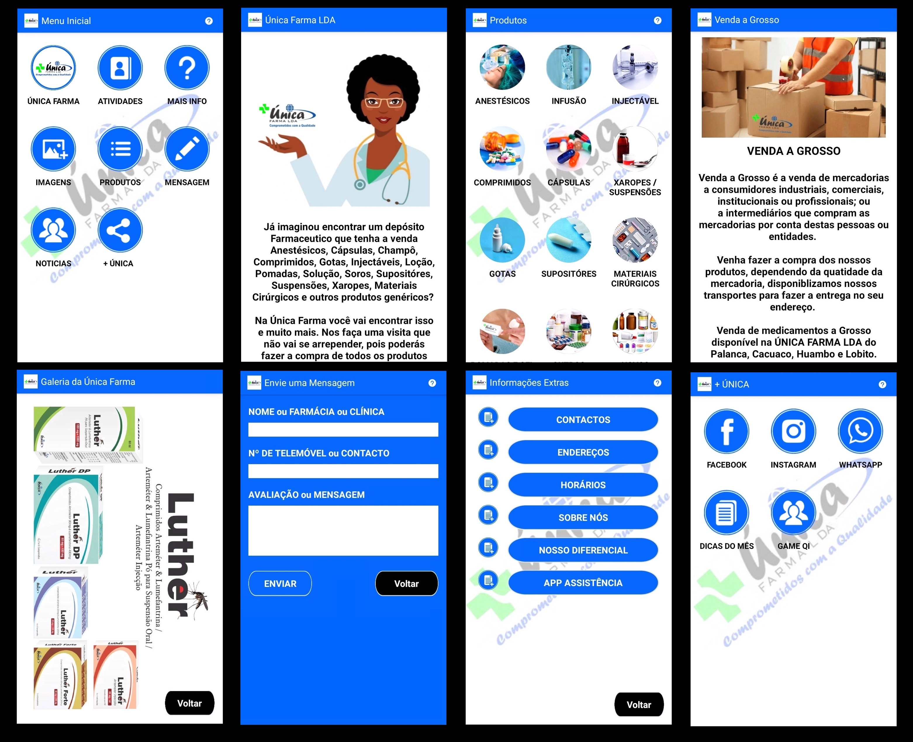
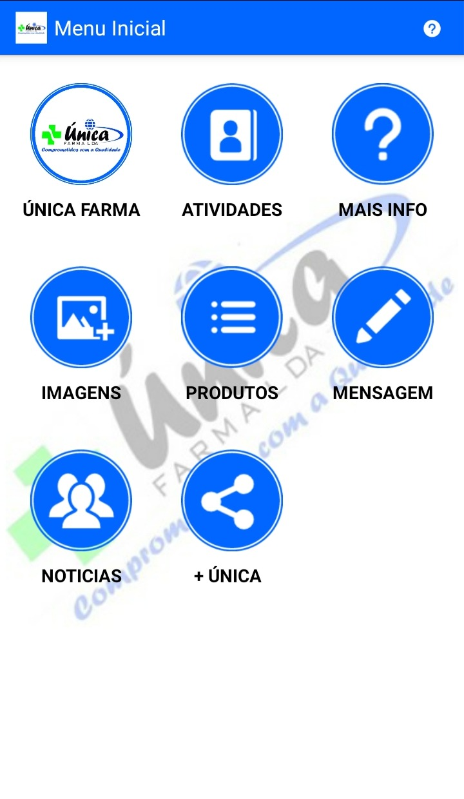
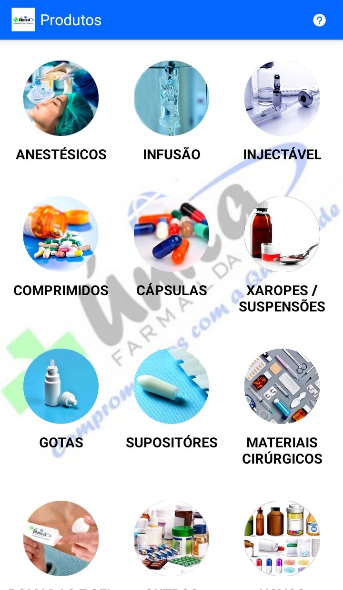
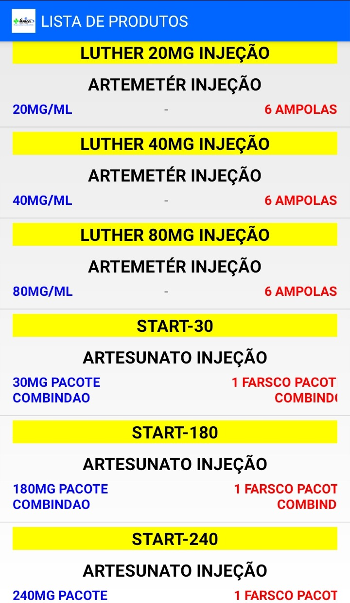
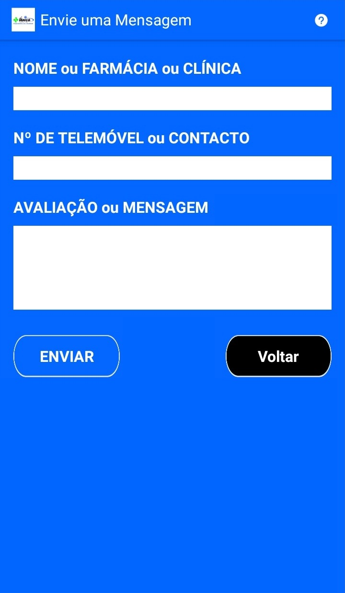
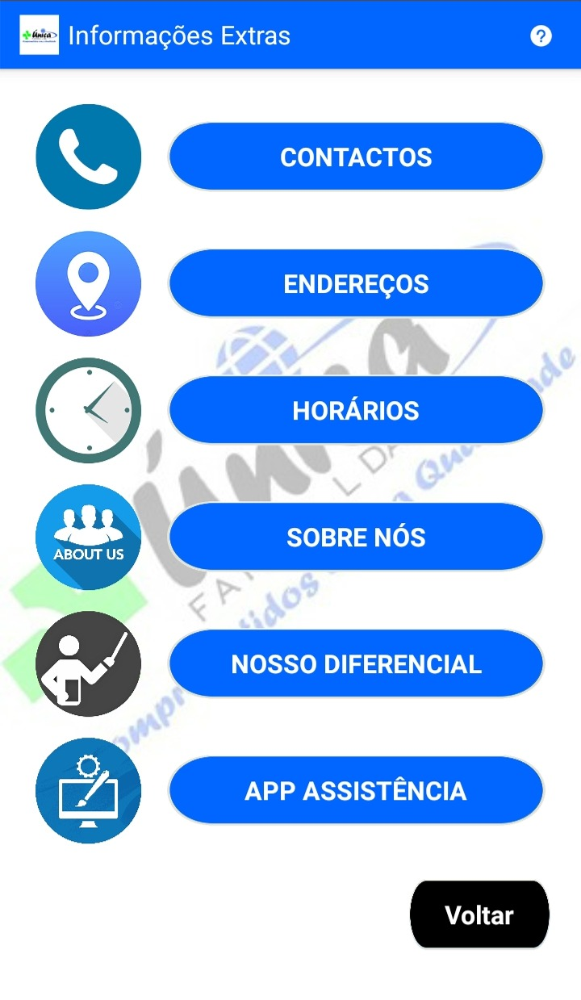
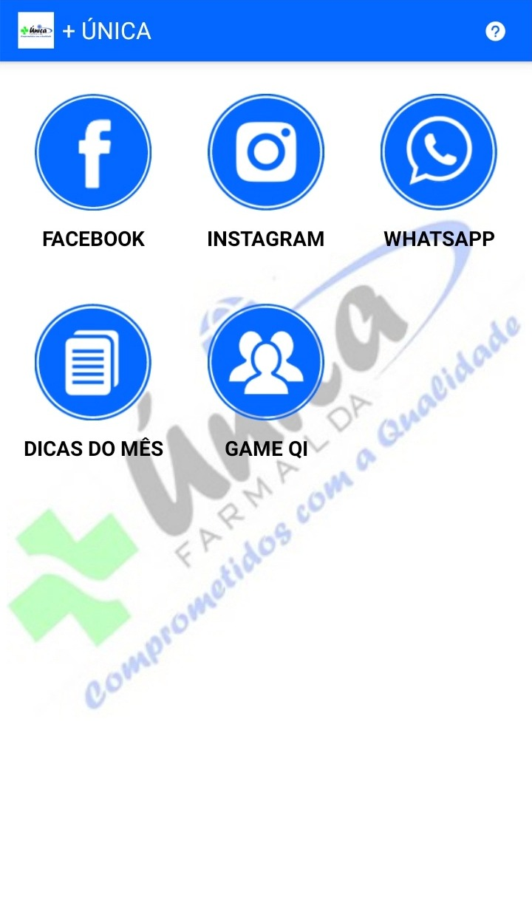
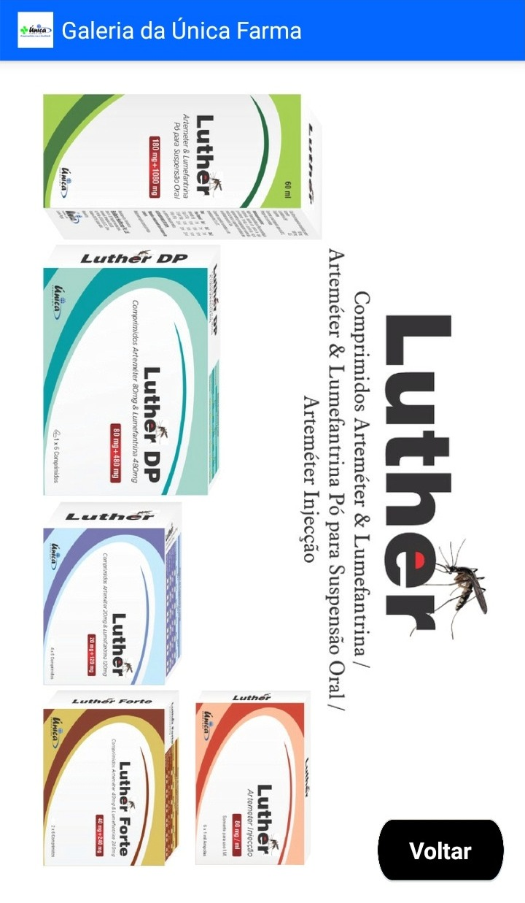

🌍 Languages: [English](README.md) | [Português Brasileiro](README.pt-BR.md)

# UnicaFarmaLDA - Android App

This project is a legacy Android application originally developed in **Eclipse** (when Android Studio was still in beta) and later migrated to **Android Studio**.  
It provides synchronization between phone data and CSV files for pharmacy management.

---

## 📌 Project Highlights

1. **CSV Data Access**  
   The application accesses the folder `raw` to read CSV files.

2. **Synchronization**  
   To access the page where CSV files are read, the code performs synchronization with phone data.

3. **Development History**  
   The code was originally created in **Eclipse** and later migrated to **Android Studio**.

4. **Libraries**  
   External libraries are included as `.jar` files inside the `libs` folder. (Maven was not yet adopted during this stage of development).

---

## 📂 Project Structure

- **src/** → Main Java source code.  
- **res/** → Layouts, drawables, and resources.  
- **raw/** → Contains CSV files accessed by the app.  
- **libs/** → External libraries (`.jar` files).  
- **APK_for_PLAYSTORE/** → Compiled APKs and screenshots for Play Store submission.  

---

## Requirements

- **Eclipse IDE with ADT Plugin** (original environment), or  
- **Android Studio** (after migration).  
- Android SDK (version depends on `build.gradle` and manifest).  

---

## How to Build

1. Open the project in **Android Studio**.  
2. Ensure the Android SDK version matches the `build.gradle` settings.  
3. Add the required `.jar` files from `/libs/` (they should already be included).  
4. Build the project (`Build → Make Project`).  
5. Run on a device or emulator (`Run → Run App`).  

---

## Historical Context

This project shows the transition period in Android development:  
- **Before Gradle/Maven**: developers manually placed `.jar` libraries inside `/libs/`.  
- **Before Android Studio dominance**: Eclipse was the main IDE.  
- **CSV reading through `raw` folder**: a common practice to bundle static data with the app.  

---

## Author

Created by     : Josemar Pedro.
Compiled date  : Before Setember, 2019.

---

## License

*MIT License

---

## 📸 Screenshots

